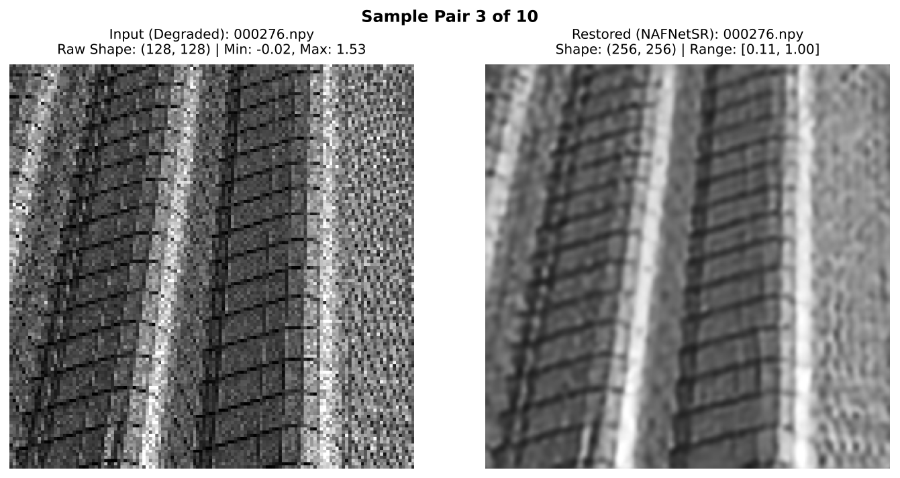
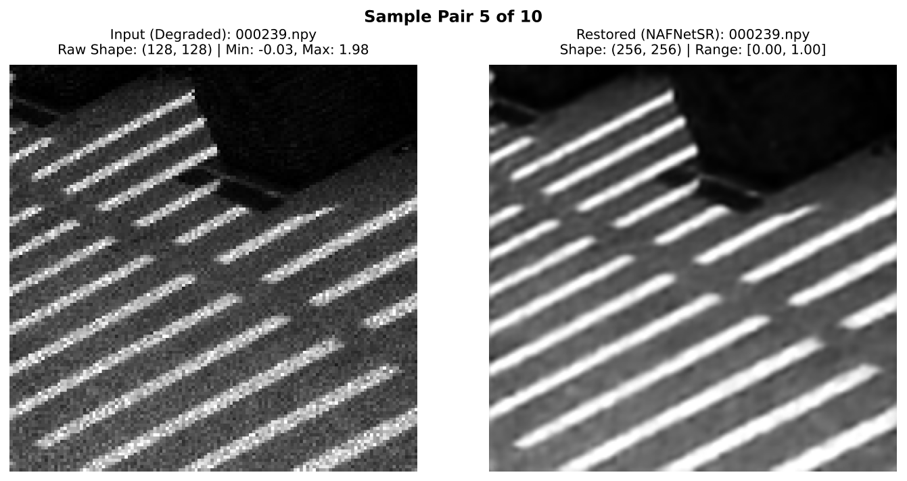
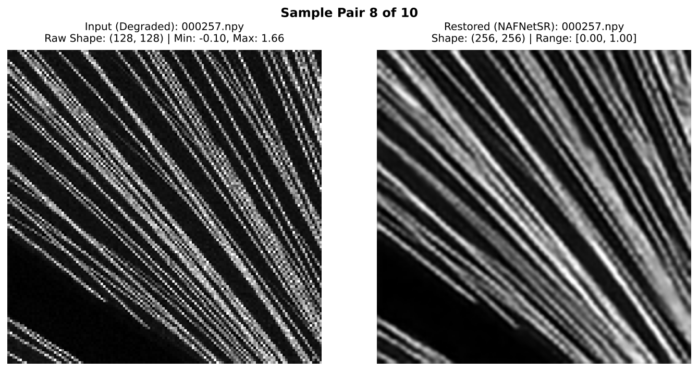

# 🔬 De-Noise Guild — SEM Image Cleanup & 2× Upscaling

[](https://www.python.org/)
[](https://pytorch.org/)
[]()

## 📌 What This Project Does

This project cleans up noisy SEM (Scanning Electron Microscope) images and makes them **2× bigger and sharper**, using a deep learning model.

Think of it like this:

- **Input:** a small, grainy, noisy image
- **Output:** a bigger, cleaner, sharper version of the same image

It was built for the **KLA Problem Statement** at the **SEMICON India Hackathon 2026**.

---

## ✨ Key Features

- SEM image denoising
- 2× image super-resolution
- NAFNet-inspired restoration architecture
- SimpleGate
- Simplified Channel Attention (SCA)
- Skip Connections
- PixelShuffle ×2
- Combined Pixel, FFT and Gradient losses
- 8-way Test-Time Augmentation (TTA)
- PSNR and SSIM evaluation
- GPU and CPU support
- Offline inference using trained model weights

---

## ⚙️ Prerequisites

Before running the project, make sure the following requirements are available.

### Software

- Python 3.10 or 3.11
- pip
- Git
- CUDA-compatible GPU is recommended for faster training and inference
- CPU execution is supported, but training and inference will be slower

### Python Environment

Create a virtual environment:

```bash
python -m venv .venv
```

Activate it on Windows:

```bash
.venv\Scripts\activate
```

Activate it on Linux/macOS:

```bash
source .venv/bin/activate
```

### Install Dependencies

```bash
pip install -r requirements.txt
```

### Input Data Format

The project works with grayscale SEM data stored as `.npy` NumPy arrays.

Expected input characteristics:

- **Format:** `.npy`
- **Image type:** Grayscale SEM image
- **Training patch size:** `128 × 128`
- **Super-resolution scale:** `2×`
- **Expected output size:** `256 × 256` for a `128 × 128` input
- Input arrays should follow the preprocessing and normalization convention implemented in `dataset.py`

> **Note:** The exact input value range depends on the preprocessing pipeline implemented in `dataset.py`. The model should be used with data following the same preprocessing convention as the training data.

---

## 🚀 How to Run It

### Step 1 — Install requirements

```bash
pip install -r requirements.txt
```

### Step 2 — Check the model file is here

```text
models/best_ema_weights.pth
```

### Step 3 — Run the program

```bash
python run.py <input-folder> <output-folder>
```

**Example:**

```bash
python run.py ./test_images ./results
```

That's it. It reads every **`.npy` SEM array from the input folder** and saves the cleaned-up, bigger version in the output folder.

---

## 🖼️ Restoration Results

The model was evaluated on multiple SEM samples. The examples below show the transformation from degraded 128 × 128 input images to restored 256 × 256 outputs.

### Sample 1 — Structural Detail Recovery

<p align="center">
  
</p>

**Input:** 128 × 128 degraded SEM image  
**Output:** 256 × 256 restored image

---

### Sample 2 — Fine Pattern Restoration

<p align="center">
  
</p>

**Input:** 128 × 128 degraded SEM image  
**Output:** 256 × 256 restored image

---

### Sample 3 — High-Frequency Detail Restoration

<p align="center">
  
</p>

**Input:** 128 × 128 degraded SEM image  
**Output:** 256 × 256 restored image

---

## 📊 Quantitative Results

The model was evaluated using **PSNR (Peak Signal-to-Noise Ratio)** and **SSIM (Structural Similarity Index)**.

Detailed evaluation results are available in the following reports:

- [10-Sample Restoration Report](./Output_Restoration_Report_10_Samples.pdf)
- [20-Sample Restoration Report](./Output_Restoration_Report_20_Samples.pdf)

### Evaluation Summary

| Metric | Result |
|---|---:|
| Average PSNR | See evaluation reports |
| Average SSIM | See evaluation reports |
| Number of Evaluation Samples | 10 / 20 |
| Input Resolution | 128 × 128 |
| Output Resolution | 256 × 256 |
| Super-Resolution Scale | 2× |

> **Note:** The exact PSNR and SSIM values are reported in the linked evaluation PDFs. Final average values should be added here once the evaluation results are extracted and verified.


### Evaluation Metrics

**PSNR (Peak Signal-to-Noise Ratio)** measures the pixel-level similarity between the restored image and the reference high-resolution image. Higher PSNR generally indicates lower reconstruction error.

**SSIM (Structural Similarity Index)** measures structural similarity between the restored and reference images. Higher SSIM indicates greater structural similarity.

Both metrics are used to evaluate the quality of the restored SEM images.

---

## 📄 Complete Evaluation Reports

- [10-Sample Restoration Report](./Output_Restoration_Report_10_Samples.pdf)
- [20-Sample Restoration Report](./Output_Restoration_Report_20_Samples.pdf)

---

## 🧠 How It Works (Simple Version)

1. **Input:** Grainy, low-resolution grayscale images (`.npy` files)
2. **Model:** A neural network called **NAFNetSR** looks at the image and learns to remove noise while adding detail
3. **Output:** A clean image that is **twice as tall and twice as wide** as the input
4. **Extra trick:** The model looks at the image 8 different ways (rotated/flipped) and averages the results — this makes the output more accurate and stable

---

## 🔬 Technical Approach

De-Noise Guild uses a NAFNet-inspired encoder-decoder architecture designed for grayscale SEM image restoration and 2× super-resolution.

### Model Pipeline

```text
Input SEM Image
      ↓
Encoder
      ↓
NAF Blocks
      ↓
Bottleneck
      ↓
Decoder + Skip Connections
      ↓
PixelShuffle ×2
      ↓
Restored SEM Image
```

### Key Components

- NAF Blocks
- SimpleGate
- Simplified Channel Attention (SCA)
- Skip Connections
- PixelShuffle ×2

### Restoration Loss

The model combines:

**Pixel Loss + FFT Loss + Gradient Loss**

This helps preserve overall image quality while improving frequency and edge/detail information.

### Inference Enhancement

8-way Test-Time Augmentation (TTA) using rotations and flips, followed by averaging the predictions.

### Evaluation

- PSNR
- SSIM

---

## 📋 What the Output Looks Like

- Same filename as the input
- 2× the height and width of the input
- Pixel values kept between `0.0` and `1.0`
- No broken/invalid values (`NaN` or `Inf` are automatically fixed)

---

## 📁 Project Files

```text
De-NoiseGuild/
│
├── assets/
│   ├── sem_sample_03_before_after.png
│   ├── sem_sample_05_before_after.png
│   └── sem_sample_08_before_after.png
│
├── models/
│   └── best_ema_weights.pth       # trained model weights
│
├── dataset.py                     # dataset loading and preprocessing
├── losses.py                      # pixel, FFT and gradient-based losses
├── model.py                       # NAFNet-inspired restoration network
├── run.py                         # inference script for image restoration
├── train.py                       # model training script
├── requirements.txt               # required Python packages
├── .gitignore                     # files excluded from version control
│
├── Output_Restoration_Report_10_Samples.pdf
│                                  # restoration results for 10 samples
│
└── Output_Restoration_Report_20_Samples.pdf
                                   # extended restoration evaluation
```

---

## 🏋️ How It Was Trained (Simple Version)

If you want to retrain the model yourself:

```bash
python train.py \
  --mode baseline \
  --hr_dir ./data/train_hr \
  --val_hr_dir ./data/val_hr \
  --patch_size 128 \
  --batch_size 8 \
  --epochs 50 \
  --lr 2e-4 \
  --checkpoint_dir ./checkpoints
```

**In plain terms:**

- Trained for **50 rounds (epochs)** over the training images
- Used a smart way of saving the "best average" version of the model weights (called EMA), so results stay stable
- Learns by comparing its cleaned-up guess to the real, high-quality image and slowly getting closer

---

## ⚠️ Limitations

Although the model improves the visual quality and resolution of noisy SEM images, there are several limitations:

- The restored image is a **model-estimated reconstruction** and should not automatically be treated as scientific ground truth.
- Performance depends on the characteristics of the training dataset.
- Results may vary when the model is applied to SEM images with noise patterns that were not represented during training.
- GPU acceleration is recommended for practical training times.
- PSNR and SSIM provide useful quantitative measurements, but they do not completely capture all aspects of visual or scientific image quality.
- For scientific or semiconductor-inspection applications, restored outputs should be validated against appropriate experimental or domain-specific ground truth before being used for critical decisions.

---

## 🔮 Future Improvements

Possible future improvements include:

- Training on a larger and more diverse SEM dataset
- Supporting additional SEM image formats
- Exploring additional image restoration architectures
- Improving inference speed for CPU environments
- Adding automated quality assessment
- Evaluating the model on images from different SEM acquisition conditions
- Developing a lightweight interface for batch restoration
- Performing domain-specific validation with semiconductor inspection experts

---

## 🎯 Quick Summary

| Feature | Details |
|---|---|
| Task | Denoise + 2× upscale SEM images |
| Input format | `.npy` grayscale arrays |
| Input resolution | 128 × 128 |
| Output format | `.npy` grayscale arrays, 2× size |
| Output resolution | 256 × 256 |
| Model | NAFNetSR (lightweight, no heavy attention layers) |
| Loss | Pixel + FFT + Gradient |
| TTA | 8-way Test-Time Augmentation |
| Evaluation | PSNR + SSIM |
| Works offline? | ✅ Yes, no internet needed |
| Hardware | Runs on GPU or CPU |

---

## 👤 Author

**Sneha Vijay Raut**

AI & Machine Engineer
